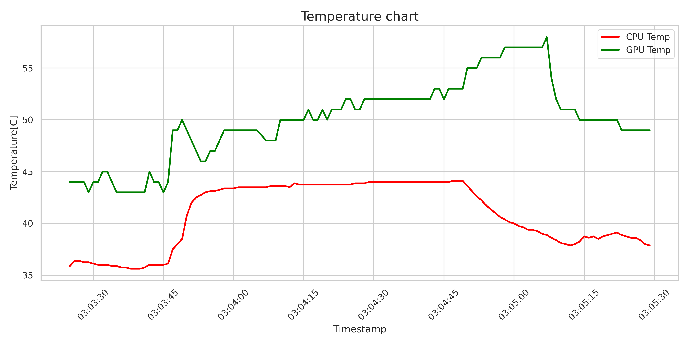

# Hardware Monitor

Lightweight hardware monitoring utility for Linux. 
Logs CPU and GPU temperatures into a .CSV file.

## Compile
make

## Run
./temp_monitor [-i interval] [-f file_name.csv] [-h]

  -i Logging interval seconds (default: 10s)

  -f Output file name (default: log.csv)

  -h Show help

## Requirements
- Linux
- GPU temperature logging requires nvidia-smi installed
- python3 with
```bash
pip install pandas seaborn matplotlib
```
You can also use this program to generate human readable chart of temperature

